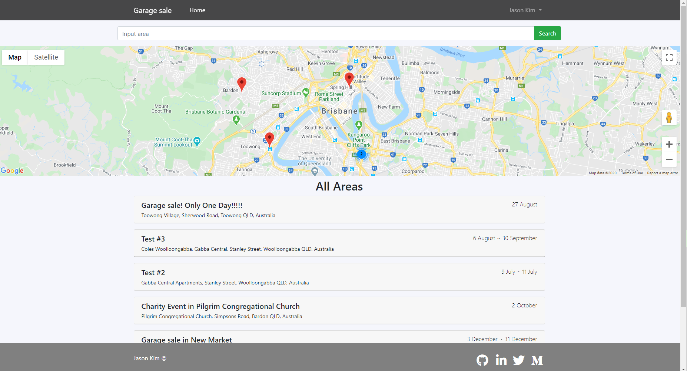
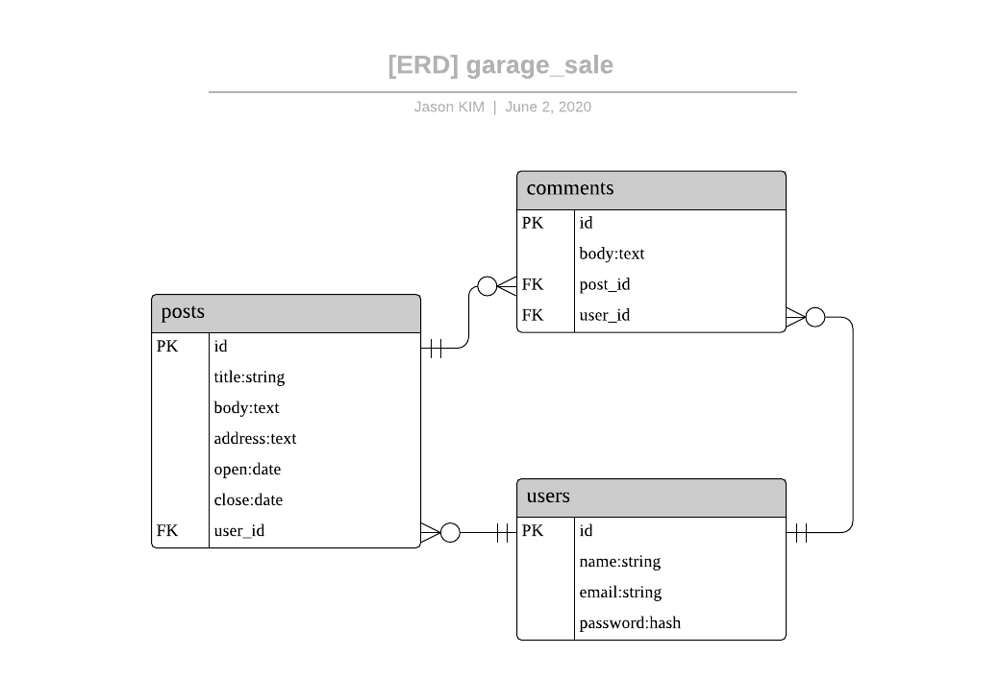

# Garage sale with Rails

## Link
### Github link : https://github.com/jasonkim7288/rails_garage_sale
### Deploy link : https://garagesalejason.herokuapp.com

## Description
Garage sale app allow users to upload their garage sales information so that other users can see and find the useful information from it. Users can simply type the area they want to find, and also manage the posts created. If the close date of a post is a week overdue, it will not be displayed and can be deleted by administrator.

## ERD

## Tech stack
- Rails : front end and back end source code
- Heroku : deploy the code
- Google Maps JavaScript API : display dynamic Google map
- Google Maps Static API : display static Google map
- Google Places API : address autocomplete function
- Stimulus js : javascript in Rails to implement Google Maps API
- OmniAuth : OAuth2 implementation gem
- Devise : login gem
- Bootstrap : a package making pages look pretty
- Tempusdominus-bootstrap-4 : DateTime picker gem