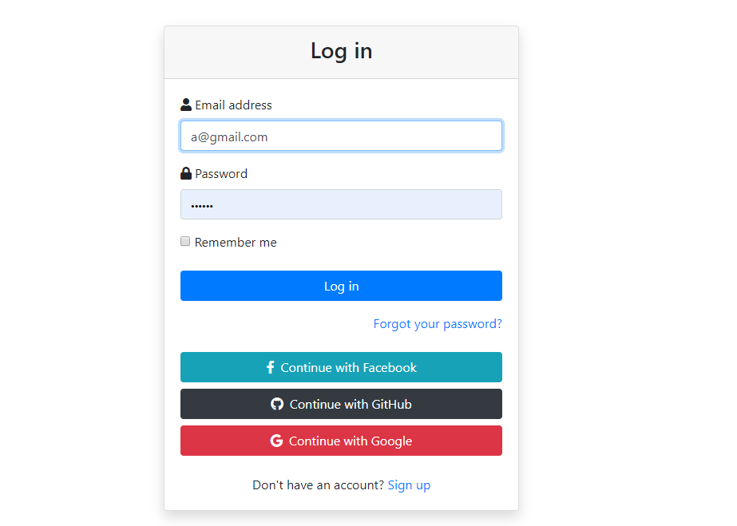

# Garage sale with Rails

## Link
### Github link : https://github.com/jasonkim7288/rails_garage_sale
### Deploy link : 

## Description
Garage sale app allow users to upload their garage sales information so that other users can see it.

<!--  -->

## Tech stack
- Rails : Front end and back end source code
- Heroku : deploy the code
- OmniAuth : OAuth2 implementation gem
- devise : login gem
- bootstrap : make pages look pretty using gem
